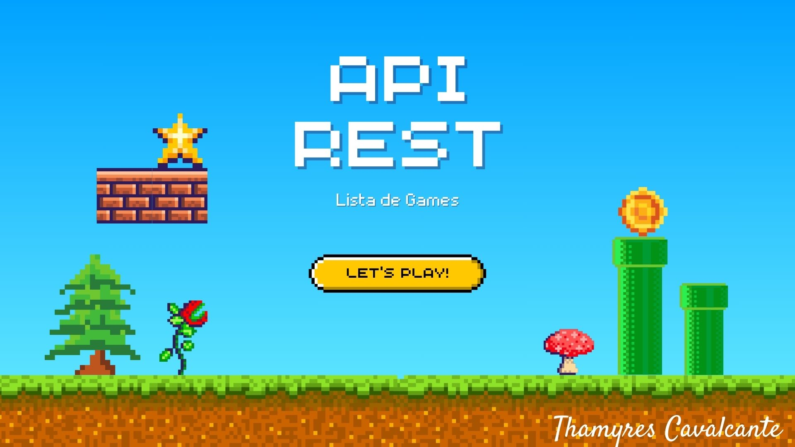
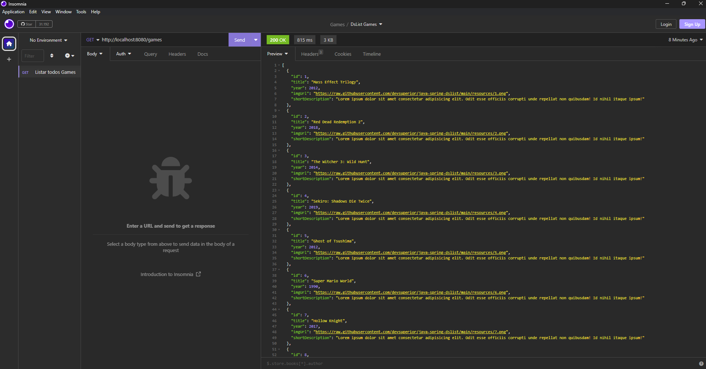

# Projeto Lista de Games

# Índice 

- [Projeto Lista de Games](#projeto-lista-de-games)
- [Índice](#índice)
  - [Descrição do projeto](#descrição-do-projeto)
  - [Técnicas e tecnologias utilizadas](#técnicas-e-tecnologias-utilizadas)
  - [Ferramentas utilizadas](#ferramentas-utilizadas)
  - [Acesso ao projeto](#acesso-ao-projeto)
  - [Funcionalidades do projeto](#funcionalidades-do-projeto)
  - [Técnicas e tecnologias utilizadas](#técnicas-e-tecnologias-utilizadas-1)
  - [Imagens](#imagens)
  - [Desenvolvedores](#desenvolvedores)
  - [Redes sociais](#redes-sociais)
    - [Feito com 💜 by Thamyres Cavalcante.](#feito-com--by-thamyres-cavalcante)

## Descrição do projeto 

 Projeto em desenvolvimento durante treinamento com o Dev Superior, em Java com Spring boot. Criação de CRUD, com estruturas de controle e injeção de dependência. Banco de dados MySQL para persistir os dados da aplicação.
 O sistema permitirá o cadastrar dos games favoritos dos usuarios.

## Técnicas e tecnologias utilizadas

- ``Java 17``
- ``Spring Boot``
- ``MySQL``
- ``InteliJ IDEA``
- ``Paradigma de orientação a objetos``

## Ferramentas utilizadas

 

 

## Acesso ao projeto

É possível acessar o projeto através do [Link](https://github.com/Thamyresmya/DS_List).
Neste repositório você tem acesso a todo o material produzido no curso.

## Funcionalidades do projeto

  `Cadastro de Games`: Nosso sistema precisa estar apto a cadastrar os games que os usuarios gostam. Para cadastrar um game, devem ser informados seu titulo, ano, genero, plataforma, nota, Url da imagem, pequena descrição do game e uma descrição longa. Todos os campos são obrigatórios. O sistema também deve gravar a data em que o autor fez cadastrado no sistema.

## Técnicas e tecnologias utilizadas
- `Sistemas web e recursos`
- `Cliente/Servidor, HTTP, Json`
- `Padrão REST para API web`
- `Estruturação de projeto Spring Rest`
- `Entidades e ORM`
- `Database seeding`
- `Padrão camadas`
- `Controller, Service, repository`
- `Padrão DTO`

## Imagens
Listar todos os Games
</img>

## Desenvolvedores

[ Thamyres Cavalcante](https://github.com/Thamyresmya)  

## Redes sociais

- [Linkedin](https://www.linkedin.com/in/thamyrescavalcante/)
- [Instagran](https://www.instagram.com/thamyres__cavalcante/)

 

---

### Feito com 💜 by Thamyres Cavalcante.

